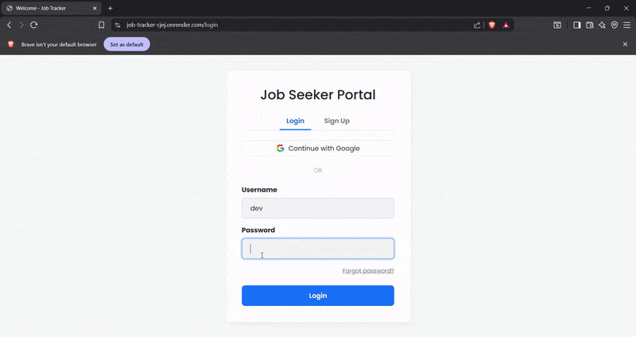

# Job Tracker 🚀

A full-stack web application built with Python and Flask, designed to streamline and visualize the job application process. This tool provides a comprehensive dashboard with key statistics and an interactive Kanban board to manage applications from wishlist to offer.



---

## ✨ Live Demo

The application is deployed and live! Check it out here:

**[Yahan Apna Vercel Link Paste Karo]**

---

## 📋 Key Features

* **📊 Dynamic Dashboard:** At-a-glance statistics for total applications, interviews, and in-progress tasks. Includes visualizations for application status distribution and top companies.
* **↔️ Interactive Kanban Board:** A separate page with a drag-and-drop interface to easily manage the application pipeline.
* **☀️/🌙 Light/Dark Mode:** A functional theme toggle that remembers the user's preference.
* **🔐 Secure User Authentication:** A complete username/password system built from scratch with password hashing to keep user data private.
* **📝 Full CRUD Functionality:** Users can Create, Read, Update, and Delete their job applications.
* **📄 Pagination:** The recent applications list on the dashboard is paginated to keep the UI clean and scalable.
* **📱 Responsive Design:** The interface is fully responsive and works beautifully on desktop, tablet, and mobile devices.

---

## 🛠️ Tech Stack

This project was built using the following technologies:

* **Backend:** Python, Flask, Gunicorn
* **Database:** SQLite
* **Data Handling & Viz:** Pandas, Matplotlib
* **Frontend:** HTML5, CSS3, JavaScript
* **Styling & UI:** Bootstrap 5, Bootstrap Icons
* **Interactivity:** SortableJS (for Drag & Drop)

---

## ⚙️ Local Setup and Installation

To run this project on your local machine, follow these steps:

1.  **Clone the repository:**
    ```bash
    git clone [https://github.com/SamyaDutta2026/Job-tracker.git](https://github.com/SamyaDutta2026/Job-tracker.git)
    ```

2.  **Navigate to the project directory:**
    ```bash
    cd Job-tracker
    ```

3.  **Create and activate a virtual environment:**
    ```bash
    # For Windows
    python -m venv venv
    .\venv\Scripts\activate

    # For macOS/Linux
    python3 -m venv venv
    source ven v/bin/activate
    ```

4.  **Install the required dependencies:**
    ```bash
    pip install -r requirements.txt
    ```

5.  **Initialize the database:**
    This command will create the `jobs.db` file and the necessary tables.
    ```bash
    python database.py
    ```

6.  **Run the application:**
    ```bash
    python app.py
    ```

The application will be running at `http://127.0.0.1:5000`.

---

## 🚀 Deployment

This application is deployed on **Vercel** and **Render**. The deployment uses the `gunicorn` WSGI server to handle production traffic.